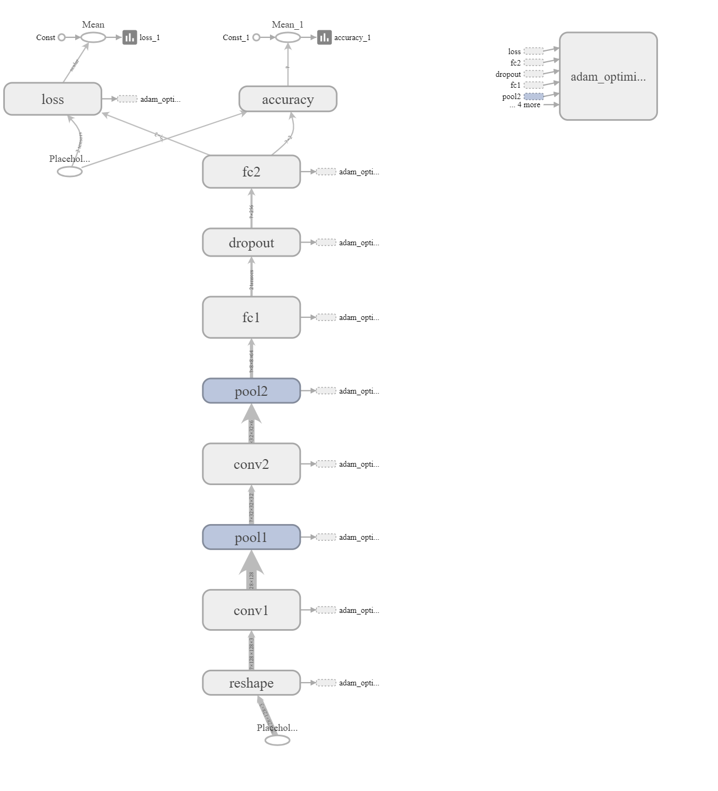

# Tensorflow_Image_Classifier
Image Classification using CNN in TensorFlow

A simple Convolution Neural Network to classify images into classes built from scratch in TensorFlow.

## Usage
To test the classifier, run
```
python test.py
```

To train the classifier, run
```
python train.py
```
### Note
Currently trained to classify road bikes and mountain bikes using very few images(~100 per class)<br> 
It's not very generalizable right now, but works for the given data<br>
Can be trained on any large custom dataset for better performance<br>
Put the custom dataset in data/train directory with image label as subdirectories

## Dependencies
* Python 3.6
* Numpy 1.x
* OpenCV 2.x or 3.x
* TensorFlow 1.8.0

## Description
* ``` data_preprocess.py ```: Contains helper functions to read and process images
* ``` model.py ```: Contains helper functions to create a tensorflow network
* ``` results/ ```: Constains saved output of test.py
* ``` models/ ```: Contains the saved model from train.py
* ``` tboard/ ```: Contains tensorboard logs from taining and testing
### Tensorboard graph

